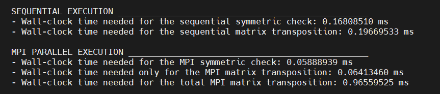

# Introduction to Parallel Computing, Homework 2
Homework for the second deliverable of the course "Introduction to parallel computing" in University of Trento.

In this repository we will analyze the behavior of an MPI code execution with different number of processes and matrix sizes.
The task to implement is a code for a matrix transposition. We will compare the wall-clock time taken and find the best solution to optimize the performance and the resource usage.  

NB: In this repository there are references to the [first deliverable](https://github.com/sophiee03/Parallel-Computing-HW-1/edit/main/README.md)

# Index
1. [Set up the Project](#set-up-the-project)
2. [Record the timings](#record-the-timings)
3. [Compilation and Execution](#compilation-and-execution)
4. [Performance Analisys](#performance-analisys)

## Set up the Project
The first thing to do is accessing the cluster (if necessary) with the `ssh` command. Then we have to start an interactive session with the following line:
```
qsub -I -q name_queue -l select=1:ncpus=60:ompthreads=60:mem=2mb
//number of nodes, number of CPU/core, number of threads[optional in this case] and memory per node 
```
Then we have to load the correct modules:
```
module load gcc91
module load mpich-3.2.1--gcc-9.1.0
```
After we start an interactive session we must enter the folder in which we want to work and create/import the file for our project, then we can start from the code of the first deliverable and modify it to make it an MPI program.

## Record the timings

To obtain the time taken for the execution we have to use the MPI_Wtime() function of the `mpi.h` library and make only one process (0) record the start and end time of execution. Then make the difference and find the Wall-clock time. 

## Compilation and Execution
Once we have our code, we can compile and execute it more times to record the timings and observe the improvements. 
To compile the code (we have to be in the folder in which the code is saved):
```
mpicc homework2.c -o hw
```
To run our compiled code we have two possibilities: 
- the first method is to use the interactive session that we have started and execute many times with different number of processes and matrix sizes. This is done with the `mpirun -np 4 ./hw 256` command, but it is time expensive, especially if we need a big number of executions.
- the second and faster method is to create a [.pbs script](script.pbs) in which we tell the compiler the number N of executions that we want. This is done by using Job Arrays: the code in the PBS script will be executed N times in the same environment with the parameters that we have included in the code (matrix size and number of threads). If we want to change parameters and test with different ones we need only to change these values. To submit this job we must write the following command: `qsub ./script.pbs` and then in our folder we will find the N output files generated.

NB: before submitting the PBS script we need to compile the code, because if we compile it inside the PBS script we will have errors in the execution. If we think about it, it is reasonable because if some processes are executing the same code and the code is recompiled from other processes in the meanwhile, there will be errors caused by the version of the executable.

The result that we will find in each file is of the following type:



***N.B.*** if you use my pbs script remember to change the folder path in which the codes are saved and the PBS directives based on your system

***N.B.*** [for windows users] if you encounter errors in the submission of the psb script, it could be a problem caused by the operating system (because you are writing in a 'windows format'). To avoid this problem use this command before submitting the job: `dos2unix script.pbs`

## Performance Analisys
After we recorded a sufficient number of executions we can make the averages for each combination (size-num_process) and compare the results by calculating the speedup, that is how much the code is faster with respect to the serial one, efficiency that measures how efficiently the resources are utilized and scalability that tells us how efficiently a program is able to maintain the execution time constant as we increase the problem size and processors.

To calculate the speedup:
```Speedup = SerialTime / ParallelTime```

To calculate the efficiency:
```Efficiency = Speedup / N_Threads```

To calculate the scalability:
```Scalability = T_serial (N) / T_parallel (p*N)```

We can observe the trend of these metrics in the following graphs:
<div style="display: flex; justify-content: space-around;">
  
  
</div>
<div style="display: flex; justify-content: space-around;">
  
  
</div>
